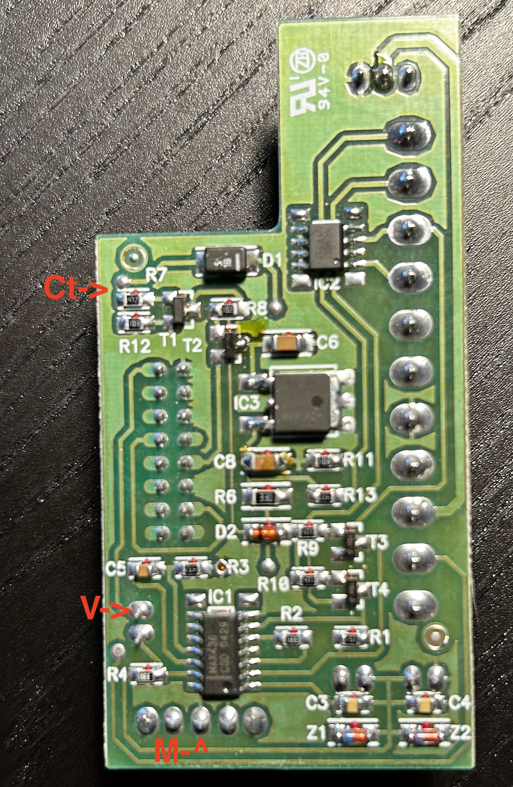

# Connecting Fermax Wi-Box to ADS system with differential video

The [Wifi Vds Call Divert Wi-Box](https://www.fermax.com/intl-en/single-products/f03266-wifi-vds-call-divert-wi-box) is designed for installation with the VDS system.
However, I own ADS monitor CityMax 2447 with respective outdoor panel.
After reviewing the technical guides provided by Fermax for both [ADS](https://www.adiglobal.cz/iiWWW/cz/Produkty110.nsf/wp/projektanti_prihlasen/%24file/ADS_trening_2008jan_en.pdf) and 
[VDS](https://doorentrydirect.com/acrobat/fermax/inst/9401/97508I_1_TECHNICAL_MANUAL_VDS_Sistem_V07_09.pdf) I couldn't find
definitive information on their compatibility. However, I did come across a successful integration attempt that inspired me to proceed.
Carlos Carbeal shared his experience on the [Developer Niku Opener](https://developer.nuki.io/t/nuki-opener-and-fermax-citymax-ads-1092/3940/33) forum,
where he described connecting the ADS terminal CityMax 2447 to the Wi-Box. He encountered an issue while programming the VDS address on the Wi-Box,
which he resolved by pressing the call button on the outdoor panel.

I followed the [Fermax Wi-Box installation gide](https://shop.fermaxaus.com.au/content/Fermax-VDS/Wi-Box%20Installation%20Quick%20Guide.pdf).
Unfortunately, in my case, neither programming the VDS address from the monitor nor pressing the call button on the outdoor panel resolved the issue.
I had to manually configure the VDS address on the Wi-Box via the command line. Additionally, I resolved a problem with the video, which in my
setup was differential and connected via AWG cabling, instead of the expected composite and coaxial cabling.

To get access the command line, it is necessary to connect the Wi-Box via UART. I found the repository by [David Girón](https://github.com/duhow/wibox),
extremely helpful; it contains all the required information and examples for modifying the Wi-Box firmware and adding MQTT functionality.

You can access the Wi-Box via UART by following the instructions provided in https://github.com/duhow/wibox/blob/main/INSTALL.md
To do so, connect a UART-USB or similar adapter and adjust the U-Boot settings to gain console access to Linux. Once the Wi-Box boots up, 
it launches the Sofia application, which has default login credentials: username: admin, password: admin.

For a detailed system description and a list of Sofia commands, refer to https://github.com/duhow/wibox/blob/main/docs/system.md
You can use "shell" command to gain root shell access.

After obtaining root access, you can test the functionality of the Wi-Box and attempt to establish a connection with the outdoor panel to open the door.
The following commands can be used:

```bash
# Open channel
echo -e '\xFB\x14\x01\x20' > /dev/ttySGK1
sleep 1
# Open door
echo -e '\xFB\x12\x01\x1E' > /dev/ttySGK1
sleep 1
# Close channel
echo -e '\xFB\x14\x00\x1F' > /dev/ttySGK1
```

You can find a comprehensive list of all UART codes, along with descriptions and the checksum algorithm [here](https://github.com/duhow/wibox/blob/main/docs/codes.md).

The Wi-Box uses either the programmed VDS address or the default one, which is `0xF0 (240)`.
To change or program the VDS address, follow these steps:
1. Determine the address assigned to your monitor. There are a few methods to do this:
  - Estimate it by counting your apartment button on the outdoor panel.
  - Use a Fermax sniffer connected to the L line, as described [here](https://github.com/kuzmin-no/Fermax_CityMax_ADS_2447)
  - Read the EEPROM of the microcontroller in your monitor, as mentioned [here](https://github.com/kuzmin-no/Fermax_CityMax_ADS_2447)
2. Reset the Wi-Box to factory defaults using [this video guide](https://www.youtube.com/watch?v=t7OitAPWH1Q)
3. Gain root access to the shell and program your VDS address into the Wi-Box microcontroller. The VDS address is `0x02` in the example below, you need to
replace it with your specific address and calculate the checksum as outlined [here](https://github.com/duhow/wibox/blob/main/docs/codes.md)

```bash
# save address
echo -e '\xFB\x18\x02\x25' > /dev/ttySGK1
# init address
echo -e '\xFB\x10\x02\x1d' > /dev/ttySGK1
```
4. Restart the Wi-Box and test it by calling your apartment from the outdoor panel.

If you don't see a video stream in the application, or even a blue screen with the date and time, try enabling the video via the command line in the Sofia application:

```bash
vionoff on
```

The Fermax Wi-Box and CityMax ADS 2447 monitor support only composite video signals. However, your installation may use AWG cabling
and differential video signals. If your monitor adapter board has labels like `Vi+` and `Vi-` instead of `V` and `M`, it indicates that your
adapter includes MAX436 `Wideband Transconductance Amplifier` on the back side of the board, which converts the differential video signal back to composite.

Photos:

- [Adapter baord front](./img/Adapter_baord_front.png)
- [Adapter baord back](./img/Adapter_baord_back.png)
- [MAX436](./img/MAX436.png)

You will need to connect V, M and Ct signals from the Wi-Box to the shown in the following photo:



Using the modified software on the Wi-Box, as described below, allows for integration with your smart home system:
- https://github.com/duhow/wibox
- https://web.archive.org/web/20211128173119/https://linuch.pl/blog/fermax-wayfi-wideodomofon-hack-czesc-3

Additionally, it is possible to implement the following scenario:
- When you arrive at the outdoor panel and press your apartment button.
- The composite video stream is captured by a composite USB capture device, such as `EasyCap`.
- A script on a `Raspberry Pi` or another device performs facial recognition, comparing the captured image with a pre-trained model's database.
- If the person is recognized and authorized, the script communicates with the Wi-Box to automatically unlock the door.
